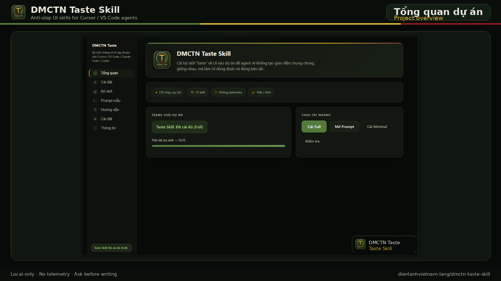
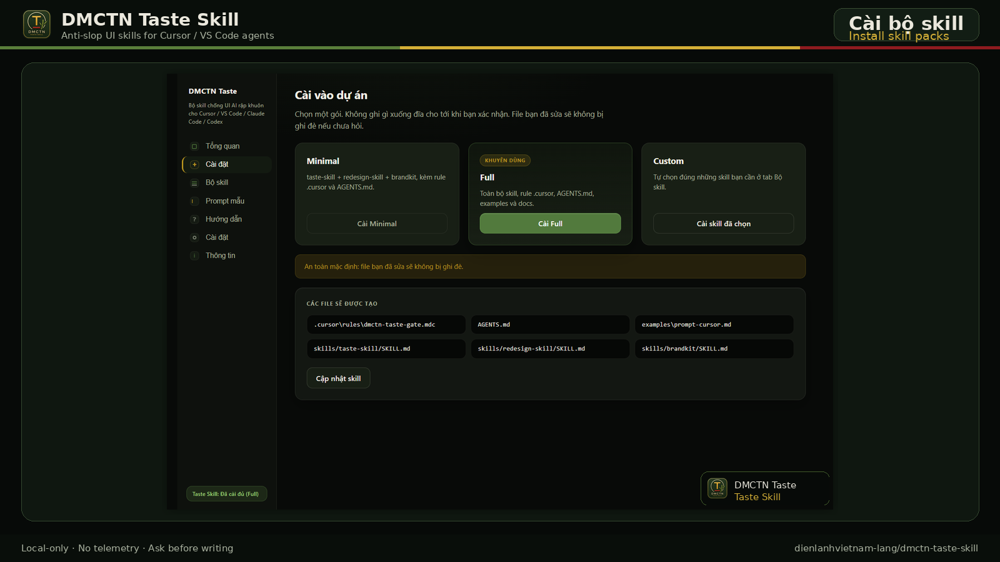
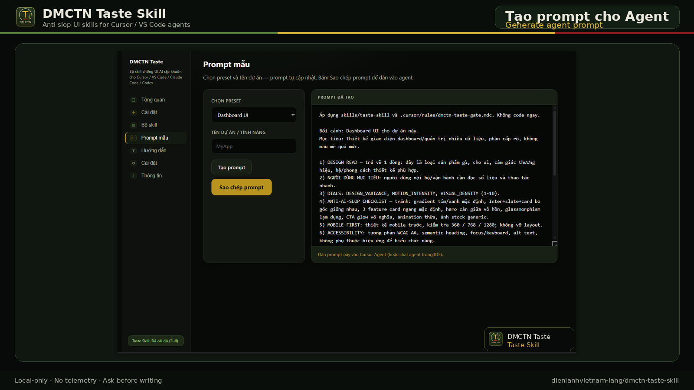
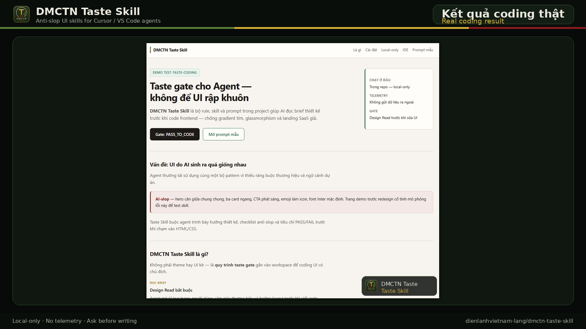

# DMCTN Taste Skill

Bộ skill chống UI rập khuôn cho Cursor, VS Code Agent, Claude Code và Codex — giúp AI đọc brief, xác định gu thiết kế, tránh giao diện AI-slope trước khi code.

Anti-slop UI taste skills for Cursor, VS Code Agent, Claude Code, and Codex — helping AI read the brief, define design taste, and avoid generic AI-generated interfaces before coding.

[](https://github.com/dienlanhvietnam-lang/dmctn-taste-skill)
[](LICENSE)
[](https://marketplace.visualstudio.com/items?itemName=buivantinh.dmctn-taste-skill)


---

## Vì sao dùng?
## Why use it?

- AI có thể code nhanh nhưng UI dễ giống template.  
  AI can code fast, but the UI often looks like a template.

- Extension này cài rule/skill/prompt vào project để agent phải Design Read trước khi code.  
  This extension installs rules/skills/prompts so agents must Design Read before coding.

- Phù hợp khi làm landing page, dashboard, app UI, redesign, image-to-code, brand kit.  
  Ideal for landing pages, dashboards, app UIs, redesigns, image-to-code, and brand kits.

- Local-only, không telemetry, không đọc secret/token.  
  Local-only, no telemetry, never reads secrets or tokens.

---

## Tính năng chính
## Key features

- **Cài Minimal / Full / Custom skill pack** — chọn gói phù hợp với dự án.  
  **Minimal / Full / Custom skill pack** — choose the right pack for your project.

- **Dashboard song ngữ Việt / Anh** — 7 tab: Tổng quan, Cài đặt, Bộ skill, Prompt mẫu, Hướng dẫn, Cài đặt extension, Thông tin.  
  **Bilingual VI / EN dashboard** — 7 tabs: Overview, Install, Skills, Prompts, Guide, Settings, About.

- **Prompt generator** — 6 preset mẫu cho Cursor và agent, kèm anti-slop checklist.  
  **Prompt generator** — 6 presets for Cursor and agents with anti-slop checklist.

- **Skill detector** — phát hiện trạng thái: Missing / Minimal / Full.  
  **Skill detector** — detects status: Missing / Minimal / Full.

- **Cập nhật có backup** — backup vào `.dmctn/taste-skill-backups/`, không ghi đè file đã sửa.  
  **Update with backup** — backups in `.dmctn/taste-skill-backups/`, never overwrites edited files.

- **An toàn** — local-only, no telemetry, hỏi trước khi ghi.  
  **Safety** — local-only, no telemetry, ask before writing.

### Design Director Core (v0.3.0)

- **Taste Gate R2** — Design Read → Taste Direction → UI Plan → Pre-Flight Lite → Anti-Slop → Self Review.  
  **Taste Gate R2** — structured gate before any UI code.

- **10 Developer Presets** — devtool, SaaS, admin dashboard, AI workspace, docs, marketplace listing, mobile utility, design system, redesign, image-to-code (không preset ngành cá nhân trong core).  
  **10 developer presets** — no personal-industry presets baked into core.

- **UI Review + Component Taste** — Design QA Score (100) và rule từng component.  
  **UI Review + Component Taste** — scored review and per-component rules.

---

## Cài đặt nhanh
## Quick start

1. **Cài extension** — [Visual Studio Marketplace](https://marketplace.visualstudio.com/items?itemName=buivantinh.dmctn-taste-skill) (khuyến nghị) hoặc VSIX từ [GitHub Releases](https://github.com/dienlanhvietnam-lang/dmctn-taste-skill/releases).  
   **Install the extension** — [Visual Studio Marketplace](https://marketplace.visualstudio.com/items?itemName=buivantinh.dmctn-taste-skill) (recommended) or VSIX from [GitHub Releases](https://github.com/dienlanhvietnam-lang/dmctn-taste-skill/releases).

2. **Mở dự án** trong VS Code hoặc Cursor.  
   **Open your project** in VS Code or Cursor.

3. Khi được hỏi, chọn **Cài đặt** → **Minimal** (3 skill lõi) hoặc **Full** (15 skill).  
   When prompted, choose **Install** → **Minimal** (3 core skills) or **Full** (all 15).

4. Chạy lệnh **DMCTN Taste: Open Dashboard** → tab **Prompt mẫu**.  
   Run **DMCTN Taste: Open Dashboard** → **Prompts** tab.

5. Chọn preset — nội dung Output **tự điền**.  
   Pick a preset — the Output area **fills automatically**.

6. Bấm **Sao chép prompt** / **Copy prompt** → dán vào Agent.  
   Click **Copy prompt** → paste into your agent chat.

7. Agent tuân `.cursor/rules/dmctn-taste-gate.mdc` và `skills/taste-skill` khi làm UI.  
   The agent should follow `.cursor/rules/dmctn-taste-gate.mdc` and `skills/taste-skill` when building UI.

---

## Cách dùng với Cursor
## How to use with Cursor

1. Sau khi **Cài Full**, mở thư mục dự án — Cursor đọc `.cursor/rules/` và `skills/`.  
   After **Full install**, open the project folder — Cursor reads `.cursor/rules/` and `skills/`.

2. Mở Dashboard → **Prompt mẫu** → chọn preset (vd. Dashboard UI) → **Sao chép prompt**.  
   Open Dashboard → **Prompts** → choose a preset (e.g. Dashboard UI) → **Copy prompt**.

3. Dán prompt vào **Cursor Agent**; yêu cầu agent trả **Design Read** trước khi sửa file UI.  
   Paste into **Cursor Agent**; require a **Design Read** before any UI file changes.

4. Nếu agent nhảy vào code ngay, nhắc: *"Chạy Taste Gate trước — đọc skills/taste-skill."*  
   If the agent codes immediately, say: *"Run Taste Gate first — read skills/taste-skill."*

---

## Cách dùng với VS Code Agent
## How to use with VS Code Agent

1. Cài extension và **Cài Full** (hoặc Minimal) vào workspace.  
   Install the extension and **Full** (or Minimal) into the workspace.

2. Mở `AGENTS.md` và thư mục `skills/` để agent đọc luật dự án.  
   Open `AGENTS.md` and the `skills/` folder so the agent reads project rules.

3. Dùng **DMCTN Taste: Generate Cursor Prompt** từ Command Palette hoặc tab Prompt trong Dashboard.  
   Use **DMCTN Taste: Generate Cursor Prompt** from the Command Palette or the Dashboard Prompts tab.

4. Kiểm tra trạng thái: **DMCTN Taste: Check Project Setup** (status bar cũng hiển thị).  
   Check status: **DMCTN Taste: Check Project Setup** (status bar also reflects state).

---

## Prompt mẫu
## Prompt templates

Sáu preset có sẵn trong Dashboard và Command Palette:  
Six presets are available in the Dashboard and Command Palette:

| Preset | Mục đích / Purpose |
|--------|-------------------|
| Dashboard UI | UI quản trị, KPI, phân cấch rõ / Admin UI, clear hierarchy |
| Landing Page | Chuyển đổi, marketing / Conversion-focused landing |
| Redesign Existing UI | Làm đẹp UI cũ, giữ hành vi / Improve UI, keep behavior |
| Full UI Audit | Audit trước khi sửa / Audit before changes |
| Mobile-first App | App ưu tiên mobile / Mobile-first screens |
| Local Business Website | Web địa phương + SEO / Local business + SEO |

Mỗi prompt gồm: Design Read, anti-slop, mobile-first, accessibility, performance, security (nếu có code), PASS/FAIL.  
Each prompt includes: Design Read, anti-slop, mobile-first, accessibility, performance, security (when relevant), PASS/FAIL.

---

## Ảnh minh họa
## Screenshots

Bốn ảnh trong `store-assets/` (1600×900) — có trong gói VSIX để README Marketplace hiển thị đúng.  
Four images in `store-assets/` (1600×900) — bundled in the VSIX so the Marketplace README renders correctly.

### Tổng quan dashboard
### Dashboard overview



Tab Tổng quan — trạng thái dự án, tiến độ skill, thao tác nhanh.  
Overview tab — project status, skill progress, quick actions.

### Cài skill vào dự án
### Install skills into a project



Gói Minimal / Full / Custom và danh sách skill.  
Minimal, Full, and Custom packs with the skills list.

### Tạo prompt cho Agent
### Generate prompts for agents



Tab Prompt mẫu — preset, output tự sinh, sao chép vào Cursor Agent.  
Prompt templates — preset, auto-generated output, copy into Cursor Agent.

### Kết quả coding thật
### Real coding result



Agent áp dụng Taste Skill — Design Read và UI anti-slop.  
Agent applying Taste Skill — Design Read and anti-slop UI result.

---

## Quyền riêng tư và an toàn
## Privacy and safety

- **Chỉ chạy cục bộ** — không gửi dữ liệu ra ngoài  
- **Local-only** — no data sent to third parties

- **Không telemetry** — không analytics, không phone-home  
- **No telemetry** — no analytics, no phone-home

- **Không đọc secret** — không đọc token, API key, `.env`  
- **No secret reading** — does not read tokens, API keys, or `.env`

- **Hỏi trước khi ghi** — cài / cập nhật chỉ khi bạn thao tác  
- **Ask before writing** — install/update only on your action

- **Gỡ có kiểm soát** — chỉ xóa file do extension quản lý  
- **Controlled remove** — removes only extension-managed paths

---

## Trạng thái phát hành
## Release status

| Hạng mục / Item | Trạng thái / Status |
|-----------------|---------------------|
| Mã nguồn GitHub / Source on GitHub | ✅ Public / READY — `main` |
| GitHub Release | ✅ v0.2.9 **DONE** |
| Runtime QA (VSIX/Cursor) | ✅ **FULL_PASS** |
| QA cài từ Marketplace public | ✅ **PASS** |
| VSIX build (repo) | ✅ READY — `dmctn-taste-skill-0.2.11.vsix` |
| Ảnh Marketplace / Store screenshots | ✅ READY — `store-assets/*.png` (1600×900) |
| Visual Studio Marketplace (live) | ✅ **PUBLISHED / PUBLIC** — v**0.2.10** |
| | ✅ **PUBLISHED / PUBLIC** — live v**0.2.10** on Marketplace |
| Gói đồng bộ README (upload thủ công) | 📦 v**0.2.11** — sync Marketplace Overview |

**Publisher:** `buivantinh` / DMCTN Studio  
**Publisher:** `buivantinh` / DMCTN Studio

---

## Lệnh
## Commands

| Lệnh / Command | Mô tả / Description |
|----------------|---------------------|
| `DMCTN Taste: Open Dashboard` | Mở dashboard / Open dashboard |
| `DMCTN Taste: Install to Current Project` | Cài Minimal / Full / Custom / Install pack |
| `DMCTN Taste: Update Skills` | Cập nhật skill (có backup) / Update with backup |
| `DMCTN Taste: Generate Cursor Prompt` | Tạo prompt / Generate prompt |
| `DMCTN Taste: Check Project Setup` | Kiểm tra cài đặt / Check install status |
| `DMCTN Taste: Remove from Project` | Gỡ file extension quản lý / Remove managed files |
| `DMCTN Taste: Switch Language` | Đổi ngôn ngữ VI / EN / Auto / Switch language |

---

## Cài đặt extension
## Extension settings

| Cài đặt / Setting | Giá trị / Values | Mặc định / Default |
|-------------------|------------------|---------------------|
| `dmctnTaste.language` | `auto`, `vi`, `en` | `auto` |
| `dmctnTaste.neverAskInstall` | boolean | `false` |
| `dmctnTaste.defaultPack` | `minimal`, `full` | `minimal` |
| `dmctnTaste.backupBeforeUpdate` | boolean | `true` |

---

## Câu hỏi thường gặp
## FAQ

**Có chạy trên Cursor không?**  
**Does it work in Cursor?**

Có — Cursor đọc `.cursor/rules/` và `skills/` như VS Code.  
Yes — Cursor reads `.cursor/rules/` and `skills/` like VS Code.

**Minimal và Full khác gì?**  
**What is the difference between Minimal and Full?**

- **Minimal** — `taste-skill`, `redesign-skill`, `brandkit` + file core  
- **Minimal** — `taste-skill`, `redesign-skill`, `brandkit` + core files

- **Full** — 15 skill + `docs/` gate (gồm `ui-review-skill`, `component-taste`)  
- **Full** — all 15 skills + `docs/` gate files (incl. UI review & component taste)

**Có ghi đè file tôi đã sửa không?**  
**Will it overwrite my edits?**

Cài đặt bỏ qua file đã có; cập nhật hỏi trước khi ghi đè và có thể backup.  
Install skips existing files; update asks before overwrite and can backup.

**Có cần internet không?**  
**Does it need the internet?**

Không, trừ khi bạn tải extension từ Marketplace.  
No, except when installing the extension from Marketplace.

**Marketplace README khác GitHub?**  
**Marketplace README differs from GitHub?**

Marketplace hiển thị README từ gói VSIX đã upload — cập nhật bằng bản VSIX mới (vd. v0.2.11).  
Marketplace shows the README from the uploaded VSIX — update by uploading a new package (e.g. v0.2.11).

---

## Phát triển
## Development

```bash
npm install
npm run compile
npm test
npm run package   # → dmctn-taste-skill-0.2.11.vsix
```

Tài liệu trên GitHub: [PUBLISH_CHECKLIST](https://github.com/dienlanhvietnam-lang/dmctn-taste-skill/blob/main/docs/PUBLISH_CHECKLIST.md) · [RUNTIME_QA_REPORT](https://github.com/dienlanhvietnam-lang/dmctn-taste-skill/blob/main/docs/RUNTIME_QA_REPORT.md)

---

## Ghi công upstream
## Upstream credit

Bản Việt hoá thực dụng, cảm hứng từ **[Leonxlnx/taste-skill](https://github.com/Leonxlnx/taste-skill)** (MIT).  
Practical Vietnamese localization inspired by **[Leonxlnx/taste-skill](https://github.com/Leonxlnx/taste-skill)** (MIT).

Giấy phép gốc / Upstream license: [`assets/credits/LICENSE_UPSTREAM.md`](assets/credits/LICENSE_UPSTREAM.md)

---

## Giấy phép
## License

MIT — xem [LICENSE](LICENSE).  
MIT — see [LICENSE](LICENSE).
