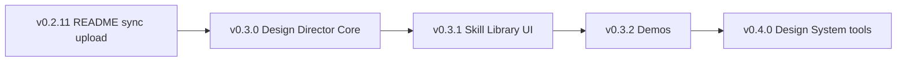

# Kế hoạch nâng cấp — DMCTN Taste Skill
# Next upgrade plan — DMCTN Taste Skill

Dựa trên audit upstream (`UPSTREAM_TASTE_SKILL_AUDIT.md`) và coverage **~59%** (`DMCTN_TASTE_SKILL_COVERAGE_REPORT.md`).

**Nguyên tắc:**

- Core **developer-generic** — không preset ngành cá nhân (điện máy, sửa chữa, cửa hàng địa phương riêng, …).
- Giữ **extension moat**: dashboard, installer, backup, song ngữ, Marketplace.
- Nâng **depth** skill markdown + gate + prompt — **không** thay runtime trong các mốc docs-only.
- Credit upstream: Leonxlnx/taste-skill (MIT).

---

## v0.3.0 — Design Director Core

**Trạng thái:** ✅ **DONE** (Core R1 — 2026-06-02) — Gate R2, taste-skill depth, 10 dev presets, Pre-Flight Lite, redesign 4 mode, `ui-review-skill`, `component-taste`, prompt Gate R2. Không publish Marketplace trong mốc này.

**Mục tiêu:** Đưa coverage từ ~59% → **~72%** (ước lượng) trên Brief, Design System, Anti-pattern, Output layers.

| Hạng mục | Deliverable | PASS nếu | FAIL nếu |
|----------|-------------|----------|----------|
| Taste Gate R2 | `dmctn-taste-gate.mdc` + `taste-skill/SKILL.md` mở rộng §0–1–2–9 (rút gọn có cấu) | Design Read + dials + 10 anti-ban chính trong gate | Thiếu VERDICT hoặc thiếu dial |
| Developer Preset Pack | Prompt presets: thêm `portfolio`, `editorial` (generic) | ≥8 preset generic, không ngành riêng | Có preset ngành cụ thể |
| UI Review Skill | Skill mới hoặc mở rộng `output-skill` → pre-flight lite | Checklist ≥15 hạng mục PASS/FAIL | Không có checklist |
| Component Taste Rules | Doc section: button, card, nav, form — trong taste-skill | 4 component types có rule | Chỉ bullet chung chung |
| Prompt Builder R2 | `promptGenerator.ts` inject pre-flight + system hint | Prompt reference pre-flight | Prompt chỉ anti-slop cũ |
| Design QA Score | Dashboard Overview: hiển thị % skill depth / gate version | User thấy “Gate v2” | Không hiển thị |

**Rủi ro:** File skill phình to → tách `taste-skill-core.md` + symlink section trong SKILL.md.  
**Không làm:** Bump chỉ vì docs; không publish CLI.

---

## v0.3.1 — Dashboard Skill Library

**Mục tiêu:** Distribution layer + Specialized layer UX.

| Hạng mục | Deliverable | PASS | FAIL |
|----------|-------------|------|------|
| Skill Library tab | Tab mới hoặc mở rộng Skills: mô tả từng skill, link file | 13 skill có mô tả VI/EN | <13 |
| Presets tab | Liệt kê preset + copy prompt | 8 preset copy được | <6 |
| Review Guide tab | Hướng dẫn Pre-Flight + redesign audit | Có checklist interactive (read-only) | Chỉ text tĩnh |
| Example prompt per skill | 1 prompt mẫu / skill (generic dev context) | ≥10 skill có example | <5 |

**Rủi ro:** Dashboard phình tab — giữ max 8–9 tab có nhóm rõ.  
**Phụ thuộc:** v0.3.0 gate/skill content.

---

## v0.3.2 — Before/After Demos

**Mục tiêu:** Marketplace + README proof (không ngành riêng).

| Demo | Mô tả | PASS |
|------|-------|------|
| Landing demo | HTML tĩnh hoặc screenshot: anti-slop landing generic SaaS | Có ảnh + caption song ngữ |
| Dashboard demo | Đã có `dashboard-overview.png` — cập nhật nếu UI đổi | Ảnh khớp v0.3.1 |
| Agent workspace demo | Screenshot prompt + Design Read + kết quả | 1 flow đủ 3 bước |

**Không làm:** Demo “cửa hàng điện máy”, “sửa chữa” — chỉ **generic dev/product** contexts.

---

## v0.4.0 — Advanced Design System

**Mục tiêu:** Design System layer ~70%+ coverage.

| Hạng mục | Deliverable | PASS | FAIL |
|----------|-------------|------|------|
| Brand Direction Builder | Wizard trong dashboard: chọn vibe + dial → export markdown brief | Export file `.md` vào project | Chỉ UI không ghi file |
| Token generator | Gợi ý CSS variables (color, space, radius) — template | File `tokens.css` mẫu | Hardcode không customize |
| Component style guide generator | Markdown style guide từ lựa chọn DS (Tailwind/shadcn/generic) | 1 guide ≥2 pages | <1 page |

**Rủi ro:** Scope creep — tách v0.4.0 thành 3 PR nhỏ.  
**Phụ thuộc:** v0.3.0 system map.

---

## Thứ tự làm đề xuất
## Recommended order

1. **Ngay:** Upload `dmctn-taste-skill-0.2.11.vsix` (manual) — Overview polish đã có trong repo.
2. **v0.3.0** — Ưu tiên **taste-skill depth** + pre-flight lite (impact cao nhất lên % coverage).
3. **v0.3.1** — Dashboard (moat).
4. **v0.3.2** — Assets Marketplace.
5. **v0.4.0** — Token/brand tools.

---

## Tiêu chí PASS/FAIL chung cho mỗi version
## General release criteria

| Kiểm tra | PASS |
|----------|------|
| `npm test` | 52/52 (hoặc số test hiện tại) PASS |
| Không regression installer/detector | Minimal + Full detect đúng |
| Không PAT/token trong repo | grep sạch |
| CHANGELOG + README song ngữ | Có mục version |
| Upstream credit | Giữ `assets/credits/` |
| Marketplace | Upload thủ công VSIX; không CLI publish từ agent |

---

## Rủi ro tổng thể
## Overall risks

| Rủi ro | Giảm thiểu |
|--------|------------|
| Copy nguyên 86 KB upstream | Vi phạm license/scope — **rút gọn có cấu**, trích dẫn ngắn |
| Skill quá dài → context window | Tách core vs specialized; gate ngắn, SKILL chi tiết |
| Runtime regression | Chỉ đổi `assets/` + docs trong mốc skill; test bắt buộc |
| Marketplace README drift | Mỗi version docs đổi → upload VSIX mới |

---

## Không nằm trong roadmap (explicit)
## Out of scope

- Open VSX publish
- Preset ngành riêng (điện máy, sửa chữa, SEO địa phương riêng, …) — preset `localbiz` hiện có giữ **generic** “local business”, không mở rộng ngành
- Thay thế hoàn toàn `npx skills add` — có thể **document** song song, không bắt buộc implement CLI

---

## Tham chiếu
## References

- `docs/UPSTREAM_TASTE_SKILL_AUDIT.md`
- `docs/DMCTN_TASTE_SKILL_COVERAGE_REPORT.md`
- `docs/DMCTN_TASTE_SKILL_GAP_ANALYSIS.md`
- Upstream: https://github.com/Leonxlnx/taste-skill
